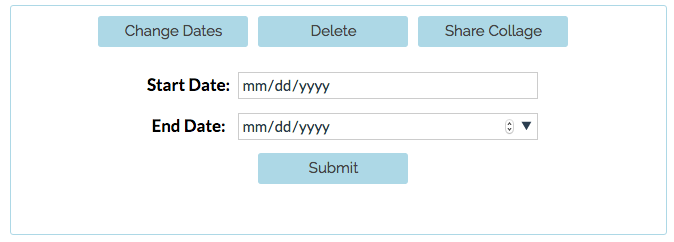
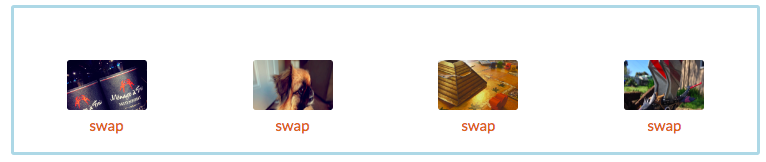
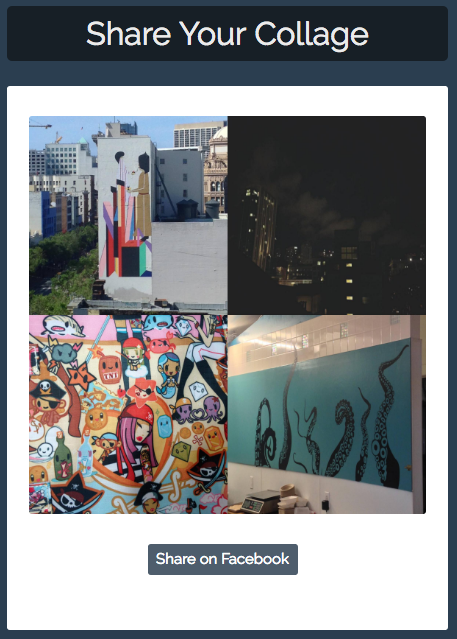

# fotos

## Project Overview

Most people have hundreds of photos stored in countless websites. It takes a significant amount of time to scroll through all of your photos to find your best memories from years ago. With Foto Time, we give you access to your memories. Choose a time range and we'll pick out a few photos from that time period. All of your photo stories are saved with Foto Time so you can review them anytime.

## Feature Additions

Our team added the following features to the existing [formidable-coffee/fotos](https://github.com/formidable-coffee/fotos) project.

### Edit & Delete Story Arcs

### Swap & Blacklist Photos from Story Arcs

### Create Photo Collage & Share to Facebook

## Technology

### Front-end

* React
* React Router
* React Bootstrap
* Babel
* Facebook API

### Back-end

* Node
* Express
* Bookshelf/Knex
* MySQL
* Facebook API
* [Photo Collage](https://www.npmjs.com/package/photo-collage)
* [Node Canvas](https://github.com/Automattic/node-canvas)

### Database Schema

## Team

* [Nicole Skoglund](https://github.com/NCSkoglund)
* [Daniel Fiore](https://github.com/taptapdan)
* [Mario Yeung](https://github.com/marioyeung)
* [Drew Kosta](https://github.com/drewkosta)

## Project Setup: Development

### Setup Facebook App ID

* Create a Facebook App on the [Facebook Developer page](https://developers.facebook.com)
* Make sure to add http://localhost:4000 to your app's Site URL.
* Create a copy of `client/config.example.jsx` and name it `client/config.jsx`.
* Set `FACEBOOK_APP_ID` to the `App ID` you are provided.

### Setup MySQL

Start up MySQL Server

	$ mysql.server start

Start a mySQL server with in the terminal (by default there is no password):

	$ mysql -u root -p

Create a database called, `fotos`. For more information, visit this [great tutorial](https://www.digitalocean.com/community/tutorials/a-basic-mysql-tutorial):

	mysql> CREATE DATABASE fotos;

Open up the database:

	mysql> USE fotos;

Create account and specifiy privileges. Here, we will be creating an `admin` account with the password `formidable`, connection from `localhost` and all access to the database, fotos. More information about users and privileges can be found [here](http://dev.mysql.com/doc/refman/5.7/en/adding-users.html "mysql Docs") AND [here](https://www.digitalocean.com/community/tutorials/how-to-create-a-new-user-and-grant-permissions-in-mysql "Digital Ocean's How-to")

	mysql> CREATE USER 'admin'@'localhost' IDENTIFIED BY 'formidable';
	mysql> GRANT ALL PRIVILEGES ON fotos.* TO 'admin'@'localhost';

### Install Webpack

	npm install -g webpack

### Install Photo Collage

	brew install pkg-config cairo libpng jpeg giflib

### Start Build Process and Server

	npm run build
	npm run serve

### View the Site

Your site will now be accessible at [http://localhost:4000](http://localhost:4000)

## Project Setup: Deploy

### Setup a MEAN Digital Ocean Droplet

* 1GB RAM (needed for npm install process)
* One click install

### Setup MySQL

[Install MySQL](https://www.digitalocean.com/community/tutorials/how-to-install-mysql-on-ubuntu-14-04)

	sudo apt-get update
	sudo apt-get install mysql-server
	sudo mysql_secure_installation
	sudo mysql_install_db
	
Setup MySQL with an `admin` user for fotos app

	Steps here	

### Setup Facebook App ID

* Create a Facebook App on the [Facebook Developer page](https://developers.facebook.com)
* Make sure to add YOUR_SERVER ADDRESS to your app's Site URL.
* Create a copy of `client/config.example.jsx` and name it `client/config.jsx`.
* Set `FACEBOOK_APP_ID` to the `App ID` you are provided.

### Install Forever.js

As root,

	npm install -g forever

### Install Webpack

As root,

	npm install -b webpack

### Install Photo Collage

As root,

	apt-get install libcairo2-dev libjpeg8-dev libpango1.0-dev libgif-dev build-essential g++

### Add deploy user

As root,

	adduser deploy

### Retrieve Project

	su - deploy
	git clone https://github.com/bocks/fotos
	cd fotos
	npm install
	
### Start Up App

As deploy, from within the project directory,

	forever start —workingDir=/home/deploy/fotos /usr/bin/rpm run build
	forever start —watch server/server.js